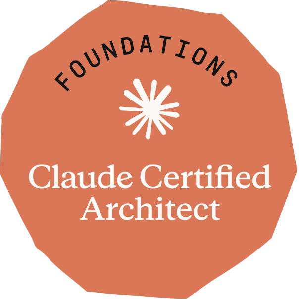

# Anthropic Learning Journey

This repository tracks my practical learning work while completing Anthropic courses and earning
the **Claude Certified Architect – Foundations** certification (passed 13 Jul 2026).

The goal is to keep a clear record of:

- courses and concepts studied
- hands-on projects built while learning
- notes, observations, and implementation tradeoffs
- exam preparation material for Claude architecture patterns

---

## 🚀 Current focus (post-certification)

With the certification earned, the repo has shifted from exam prep to **building as an AI engineer**
(application layer, Python-first):

- **Python working fluency** — [`docs/PYTHON-FLUENCY.md`](docs/PYTHON-FLUENCY.md), a 12-batch
  tutor-then-quiz study plan (tooling → idioms → typing → async → Pydantic → pytest) with a
  hands-on drill per batch and an exit test. Calibrated for an experienced engineer switching
  languages, not a beginner course.
- **Portfolio projects** — a progression of shipped projects (structured-output CLI → RAG with an
  eval harness → tool-using agent → deployed capstone), each as its own public repo as it lands.
- The `certification/` folder below is now **reference material** — kept as a record of how the
  cert was earned.

---

## 🎓 Certification: Claude Certified Architect – Foundations

<a href="https://www.credly.com/badges/da535870-7752-4593-85ef-0e0feeca3207/public_url">
  
</a>

> ✅ **PASSED — Mon 13 Jul 2026: 781 / 1000** (pass mark 720) ·
> [**Verify on Credly**](https://www.credly.com/badges/da535870-7752-4593-85ef-0e0feeca3207/public_url)

Multiple-choice, scenario-based, scaled score out of 1000.
**5 domains:** Agentic Architecture (27%) · Tool Design & MCP (18%) · Claude Code Config (20%) ·
Prompt Engineering & Structured Output (20%) · Context & Reliability (15%).

> 🏆 **Official practice exam (1 Jul 2026): 969 / 1000 — 58/60 correct (96.7%).**
> Per scenario: Customer Support 14/15 · Multi-Agent Research 15/15 · Code Gen with Claude Code
> 15/15 · Claude Code CI 14/15. Exam-week prep was driven by
> [`certification/EXAM-WEEK-CHECKLIST.md`](certification/EXAM-WEEK-CHECKLIST.md).


📖 **Start here:** [`certification/EXAM-PREP.md`](certification/EXAM-PREP.md) — the single
"everything you need to pass" file (domain digests, answer-selection heuristics, fact cheatsheet,
sample-question analysis, out-of-scope list). Read it before and after building the projects.

📝 **Theory notes checklist:** [`certification/NOTES-TOPICS.md`](certification/NOTES-TOPICS.md) — the
full list of topics to write your own notes on (built from the domains + the Appendix's Technologies,
In-Scope, and Out-of-Scope lists). The exam is theory-heavy; the projects alone won't cover it.

🗓️ **Daily driver (during prep):** [`certification/STUDY-PLAN.md`](certification/STUDY-PLAN.md) —
a **60-day** day-by-day tracker with a morning checklist and a nightly log slot for every day, plus
phases, weekly checkpoints, and a Go/No-Go readiness gate. The exam was originally targeted for
~Fri 2026-08-14 and sat a month early on Mon 2026-07-13 after the practice exam came back at 969/1000.

### Daily workflow (slash commands)

Two project-scoped slash commands (in `.claude/commands/`, so they sync via git) drive the daily
ritual — originally built for exam prep (itself Domain 3 practice), now repointed at the
post-cert roadmap:

- **`/today`** — writes the day's brief to `docs/TODAY.md` with all referenced material **inlined**
  (current Python batch topics, the drill, the next project step), so the source files never need
  opening. Boxes get ticked in that file during the day.
- **`/log`** *(e.g. `/log finished batch 2, confidence 4, revisit decorators)`* — reads the ticks
  from `TODAY.md`, propagates them to the study-plan files, and appends a dated line to a daily
  ledger. Run it each night.

> The checkboxes are Claude's memory between sessions — keep them current via `/log` or the daily
> brief will drift.

### Study plan (phases — completed; see `STUDY-PLAN.md` for the daily record)

- [x] **Phase 0 (Day 1):** Read [`EXAM-PREP.md`](certification/EXAM-PREP.md) end-to-end; set up dev env
- [x] **Phase 1 (Days 2–21):** Write notes for every topic in [`NOTES-TOPICS.md`](certification/NOTES-TOPICS.md) — all 119 topics, every domain verification-tested
- [x] **Phase 2:** Hands-on projects (see status below — deliberately trimmed once theory proved exam-ready)
- [x] **Phase 3:** Sample-question re-derivation; scenario drills; cross-domain mocks (19/20, 20/20)
- [x] **Phase 4:** Official Practice Exam 969/1000 → taper → **exam passed 781/1000**
- [x] **Go/No-Go gate:** practice exam ≥ ~80%, all heuristics recitable, Weak List empty

### Certification projects (final status)

Each project has a detailed build guide. After the practice exam came back at 96.7%, projects 02 &
03 were deliberately skipped (their prep-exercise guides were studied instead) — theory was already
exam-ready and building them would not have moved the score.

- [x] **01 — Customer Support Resolution Agent** · Scenario 1 · Domains 1, 2, 5 — **built** (`projects/cert-01-customer-support-agent/`)
  → [`certification/projects/01-customer-support-agent/overview.md`](certification/projects/01-customer-support-agent/overview.md)
  *(agentic loop, deterministic gates, structured errors, hooks, escalation calibration)*
  — split into 5 phases; in-depth Phase 1 walkthrough (with code) in
  [`phase-1.md`](certification/projects/01-customer-support-agent/phase-1.md)
- [ ] **02 — Claude Code Team Workflow** · Scenario 2 · Domains 3, 2, 5 — skipped (guide studied)
  → [`certification/projects/02-claude-code-team-workflow/overview.md`](certification/projects/02-claude-code-team-workflow/overview.md)
  *(CLAUDE.md hierarchy, path rules, commands, skills, MCP config, plan mode)*
- [ ] **03 — Structured Data Extraction Pipeline** · Scenario 6 · Domains 4, 5 — skipped (guide studied)
  → [`certification/projects/03-structured-data-extraction.md`](certification/projects/03-structured-data-extraction.md)
  *(tool_use schemas, tool_choice, validation/retry, batch API, human review routing)*
- [x] **04 — Multi-Agent Research Pipeline** · Scenario 3 · Domains 1, 2, 5 — **built** (`projects/cert-04-multi-agent-research/`)
  → [`certification/projects/04-multi-agent-research/overview.md`](certification/projects/04-multi-agent-research/overview.md)
  *(coordinator/subagent, Task tool, parallel spawn, error propagation, provenance)*
- [ ] **05 — Claude Code in CI/CD** · Scenario 5 · Domains 3, 4 — partially built (`projects/cert-05-claude-code-cicd/`)
  → [`certification/projects/05-claude-code-cicd/overview.md`](certification/projects/05-claude-code-cicd/overview.md)
  *(-p/--print, json-schema output, explicit criteria, independent + multi-pass review)*
- [ ] **06 — Developer Productivity / Codebase Explorer** · Scenario 4 · Domains 2, 3, 1 — partially built (`projects/cert-06-developer-productivity-explorer/`)
  → [`certification/projects/06-developer-productivity-explorer/overview.md`](certification/projects/06-developer-productivity-explorer/overview.md)
  *(built-in tool selection, MCP resources, scratchpads, sessions, fork/resume)*

### Domain coverage map

| Domain (weight) | Projects that drill it |
|-----------------|------------------------|
| 1 — Agentic Architecture & Orchestration (27%) | 01, 04, 06 |
| 2 — Tool Design & MCP Integration (18%) | 01, 02, 04, 06 |
| 3 — Claude Code Configuration & Workflows (20%) | 02, 05, 06 |
| 4 — Prompt Engineering & Structured Output (20%) | 03, 05 |
| 5 — Context Management & Reliability (15%) | 01, 03, 04, 06 |

### Official Preparation Exercises (source)

The Exam Guide (v0.2, Jun 30 2026) ships **4 official Preparation Exercises** (pp. 31–34,
unchanged from v0.1). These files record each one
**verbatim** with a step→build mapping to the projects above. (The exam has only 4 exercises, so
projects 05–06 are my own additions with no official source.)

- [`prep-exercise-01-multi-tool-agent.md`](certification/projects/prep-exercise-01-multi-tool-agent.md) → Project 01
- [`prep-exercise-02-claude-code-team-workflow.md`](certification/projects/prep-exercise-02-claude-code-team-workflow.md) → Project 02
- [`prep-exercise-03-structured-data-extraction.md`](certification/projects/prep-exercise-03-structured-data-extraction.md) → Project 03
- [`prep-exercise-04-multi-agent-research.md`](certification/projects/prep-exercise-04-multi-agent-research.md) → Project 04

---

## Course projects

### 01. Introduction to Model Context Protocol

Path: `projects/01-introduction-to-model-context-protocol`

Built while going through the **Introduction to Model Context Protocol** course. Implements a
command-line Claude chat app with a local MCP document server, covering tools, resources, prompts,
document mentions, and command-style prompt execution.

### 02. Model Context Protocol — Advanced Topics

Path: `projects/02-model-context-protocol-advanced-topic`

Built while going through the advanced MCP material — focuses on observability (logging and progress
notifications) for MCP servers.

### 03. MCP Chat CLI

Path: `projects/mcp-chat-cli`

A from-scratch rebuild of the MCP chat application: an interactive command-line Claude chat with an
agentic tool-execution loop, a FastMCP document server over stdio, `@doc` mentions, and
`/prompt`-style commands. Built post-course to consolidate the MCP client/server patterns without
following along.

## Repository structure

```text
.claude/
  commands/
    today.md                   # /today — daily roadmap brief, written to docs/TODAY.md
    log.md                     # /log   — evening ritual: tick boxes + append daily ledger
docs/
  PYTHON-FLUENCY.md            # post-cert Python fluency study plan (12 batches + drills)
certification/                 # ✅ cert earned 13 Jul 2026 — kept as reference
  EXAM-PREP.md                 # master study guide
  NOTES-TOPICS.md              # checklist of theory topics (all noted)
  STUDY-PLAN.md                # 60-day day-by-day tracker (complete record)
  projects/
    01-customer-support-agent/               # Project 01 guides (overview + 5 phases + production)
      overview.md           # phased build guide (5 phases)
      phase-1.md   # in-depth Phase 1 walkthrough (code)
      ...                                    # phase-2..5 + production
    02-claude-code-team-workflow/
      overview.md
    03-structured-data-extraction.md
    04-multi-agent-research/
      overview.md   phase-0.md (setup) … phase-5.md
    05-claude-code-cicd/
      overview.md   phase-1.md … phase-5.md
    06-developer-productivity-explorer/
      overview.md   phase-1.md … phase-5.md
    prep-exercise-01-multi-tool-agent.md     # official Exam Guide exercises (verbatim source)
    prep-exercise-02-claude-code-team-workflow.md
    prep-exercise-03-structured-data-extraction.md
    prep-exercise-04-multi-agent-research.md
projects/
  01-introduction-to-model-context-protocol/
  02-model-context-protocol-advanced-topic/
  mcp-chat-cli/                              # from-scratch MCP chat rebuild (post-course)
  cert-01-customer-support-agent/            # Cert project 01 — built
  cert-04-multi-agent-research/              # Cert project 04 — built
  cert-05-claude-code-cicd/                  # Cert project 05 — partial
  cert-06-developer-productivity-explorer/   # Cert project 06 — partial
```

More notes and projects will be added as the post-certification roadmap progresses — portfolio
projects will land as their own repos.
