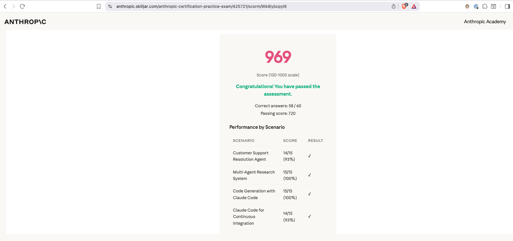

# Anthropic Learning Journey

This repository tracks my practical learning work while completing Anthropic courses and preparing
for the **Claude Certified Architect – Foundations** certification.

The goal is to keep a clear record of:

- courses and concepts studied
- hands-on projects built while learning
- notes, observations, and implementation tradeoffs
- exam preparation material for Claude architecture patterns

---

## 🎓 Certification: Claude Certified Architect – Foundations

**Target:** scaled score ≥ **720 / 1000** (pass/fail). Multiple-choice, scenario-based.
**5 domains:** Agentic Architecture (27%) · Tool Design & MCP (18%) · Claude Code Config (20%) ·
Prompt Engineering & Structured Output (20%) · Context & Reliability (15%).

> 🏆 **Official practice exam (1 Jul 2026): 969 / 1000 — 58/60 correct (96.7%).**
> Per scenario: Customer Support 14/15 · Multi-Agent Research 15/15 · Code Gen with Claude Code
> 15/15 · Claude Code CI 14/15. Real exam: **Sat 11 Jul 2026** — prep driven by
> [`certification/EXAM-WEEK-CHECKLIST.md`](certification/EXAM-WEEK-CHECKLIST.md).



📖 **Start here:** [`certification/EXAM-PREP.md`](certification/EXAM-PREP.md) — the single
"everything you need to pass" file (domain digests, answer-selection heuristics, fact cheatsheet,
sample-question analysis, out-of-scope list). Read it before and after building the projects.

📝 **Theory notes checklist:** [`certification/NOTES-TOPICS.md`](certification/NOTES-TOPICS.md) — the
full list of topics to write your own notes on (built from the domains + the Appendix's Technologies,
In-Scope, and Out-of-Scope lists). The exam is theory-heavy; the projects alone won't cover it.

🗓️ **Daily driver:** [`certification/STUDY-PLAN.md`](certification/STUDY-PLAN.md) — a **60-day**
day-by-day tracker (start Tue 2026-06-16 → exam ~Fri 2026-08-14) with a morning checklist and a
nightly log slot for every day, plus phases, weekly checkpoints, and a Go/No-Go readiness gate.

### Daily workflow (slash commands)

Don't read the files manually each day — drive the plan with two project-scoped slash commands
(in `.claude/commands/`, so they sync via git):

- **`/today`** — shows today's checklist with all referenced material **inlined** (the actual
  NOTES topics, project build steps, EXAM-PREP sections), so you never open the other files. It
  finds your current day from the unchecked boxes and sanity-checks it against the calendar.
- **`/log`** *(e.g. `/log finished all tasks, confidence 4, revisit tool_choice)`* — writes that
  day's 🌙 evening log and ticks the boxes you completed. Run it each night.

> The checkboxes are Claude's memory between sessions — keep them current via `/log` or the daily
> brief will drift. (Bonus: building these commands is itself Domain 3 exam practice — see sample Q4.)

### Study plan (phases — see `STUDY-PLAN.md` for the daily breakdown)

- [ ] **Phase 0 (Day 1):** Read [`EXAM-PREP.md`](certification/EXAM-PREP.md) end-to-end; set up dev env
- [ ] **Phase 1 (Days 2–21):** Write notes for every topic in [`NOTES-TOPICS.md`](certification/NOTES-TOPICS.md)
- [ ] **Phase 2 (Days 22–44):** Build all 6 hands-on projects (below)
- [ ] **Phase 3 (Days 45–54):** Re-derive all 12 sample questions; scenario drills; weak-area grind; mock
- [ ] **Phase 4 (Days 56–60):** Official Practice Exam, remediate, taper → exam
- [ ] **Go/No-Go gate:** practice exam ≥ ~80%, all heuristics recitable, Weak List empty

### Certification projects (to-do)

Each project has a detailed build guide. Tick the box when its "Definition of done" checklist passes.

- [ ] **01 — Customer Support Resolution Agent** · Scenario 1 · Domains 1, 2, 5
  → [`certification/projects/01-customer-support-agent/overview.md`](certification/projects/01-customer-support-agent/overview.md)
  *(agentic loop, deterministic gates, structured errors, hooks, escalation calibration)*
  — split into 5 phases; in-depth Phase 1 walkthrough (with code) in
  [`phase-1.md`](certification/projects/01-customer-support-agent/phase-1.md)
- [ ] **02 — Claude Code Team Workflow** · Scenario 2 · Domains 3, 2, 5
  → [`certification/projects/02-claude-code-team-workflow/overview.md`](certification/projects/02-claude-code-team-workflow/overview.md)
  *(CLAUDE.md hierarchy, path rules, commands, skills, MCP config, plan mode)*
- [ ] **03 — Structured Data Extraction Pipeline** · Scenario 6 · Domains 4, 5
  → [`certification/projects/03-structured-data-extraction.md`](certification/projects/03-structured-data-extraction.md)
  *(tool_use schemas, tool_choice, validation/retry, batch API, human review routing)*
- [ ] **04 — Multi-Agent Research Pipeline** · Scenario 3 · Domains 1, 2, 5
  → [`certification/projects/04-multi-agent-research/overview.md`](certification/projects/04-multi-agent-research/overview.md)
  *(coordinator/subagent, Task tool, parallel spawn, error propagation, provenance)*
- [ ] **05 — Claude Code in CI/CD** · Scenario 5 · Domains 3, 4
  → [`certification/projects/05-claude-code-cicd/overview.md`](certification/projects/05-claude-code-cicd/overview.md)
  *(-p/--print, json-schema output, explicit criteria, independent + multi-pass review)*
- [ ] **06 — Developer Productivity / Codebase Explorer** · Scenario 4 · Domains 2, 3, 1
  → [`certification/projects/06-developer-productivity-explorer/overview.md`](certification/projects/06-developer-productivity-explorer/overview.md)
  *(built-in tool selection, MCP resources, scratchpads, sessions, fork/resume)*

### Domain coverage map

| Domain (weight) | Projects that drill it |
|-----------------|------------------------|
| 1 — Agentic Architecture & Orchestration (27%) | 01, 04, 06 |
| 2 — Tool Design & MCP Integration (18%) | 01, 02, 04, 06 |
| 3 — Claude Code Configuration & Workflows (20%) | 02, 05, 06 |
| 4 — Prompt Engineering & Structured Output (20%) | 03, 05 |
| 5 — Context Management & Reliability (15%) | 01, 03, 04, 06 |

### Official Preparation Exercises (source)

The Exam Guide (v0.2, Jun 30 2026) ships **4 official Preparation Exercises** (pp. 31–34,
unchanged from v0.1). These files record each one
**verbatim** with a step→build mapping to the projects above. (The exam has only 4 exercises, so
projects 05–06 are my own additions with no official source.)

- [`prep-exercise-01-multi-tool-agent.md`](certification/projects/prep-exercise-01-multi-tool-agent.md) → Project 01
- [`prep-exercise-02-claude-code-team-workflow.md`](certification/projects/prep-exercise-02-claude-code-team-workflow.md) → Project 02
- [`prep-exercise-03-structured-data-extraction.md`](certification/projects/prep-exercise-03-structured-data-extraction.md) → Project 03
- [`prep-exercise-04-multi-agent-research.md`](certification/projects/prep-exercise-04-multi-agent-research.md) → Project 04

---

## Course projects

### 01. Introduction to Model Context Protocol

Path: `projects/01-introduction-to-model-context-protocol`

Built while going through the **Introduction to Model Context Protocol** course. Implements a
command-line Claude chat app with a local MCP document server, covering tools, resources, prompts,
document mentions, and command-style prompt execution.

### 02. Model Context Protocol — Advanced Topics

Path: `projects/02-model-context-protocol-advanced-topic`

Built while going through the advanced MCP material — focuses on observability (logging and progress
notifications) for MCP servers.

## Repository structure

```text
.claude/
  commands/
    today.md                   # /today — daily brief with referenced material inlined
    log.md                     # /log   — record evening reflection + tick boxes
certification/
  EXAM-PREP.md                 # master study guide (read this)
  NOTES-TOPICS.md              # checklist of theory topics to write notes on
  STUDY-PLAN.md                # 60-day day-by-day tracker (driven via /today and /log)
  projects/
    01-customer-support-agent/               # Project 01 guides (overview + 5 phases + production)
      overview.md           # phased build guide (5 phases)
      phase-1.md   # in-depth Phase 1 walkthrough (code)
      ...                                    # phase-2..5 + production
    02-claude-code-team-workflow/
      overview.md
    03-structured-data-extraction.md
    04-multi-agent-research/
      overview.md   phase-0.md (setup) … phase-5.md
    05-claude-code-cicd/
      overview.md   phase-1.md … phase-5.md
    06-developer-productivity-explorer/
      overview.md   phase-1.md … phase-5.md
    prep-exercise-01-multi-tool-agent.md     # official Exam Guide exercises (verbatim source)
    prep-exercise-02-claude-code-team-workflow.md
    prep-exercise-03-structured-data-extraction.md
    prep-exercise-04-multi-agent-research.md
projects/
  01-introduction-to-model-context-protocol/
  02-model-context-protocol-advanced-topic/
  cert-01-customer-support-agent/            # Project 01 implementation (in progress)
```

More notes, projects, and exam-prep material can be added as the learning path grows.
